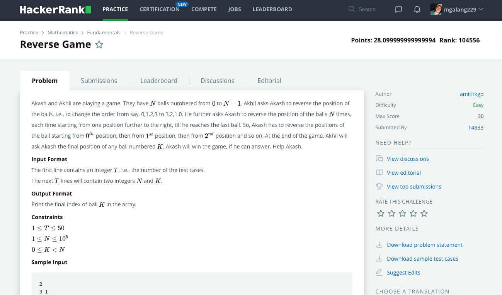

# Hackerrank-Reverse-Game
### Problem

### Program Simulation
<pre>
  Sample Input: 3 1

  n = 3, k = 1

  * i = 0
  if(1 < 0) = false
  else:
  k = 1 - 0 = 1
  k = 1
  k = 3 - 0 - 1 - 1 = 1
  k = 1
  k = 1 + 0 = 1
  k = 1
  return

  * i = 1
  if(1 < 1) = false
  else:
  k = 1 - 1 = 0
  k = 0
  k = 3 - 1 - 1 - 0 = 1
  k = 1
  k = 1 + 1 = 2
  k = 2
  return

  * i = 2
  if(1 < 2) = true
  break

  print k

  Final Output:
  2
  

  Sample Input: 5 2

  n = 5, k = 2

  * i = 0
  if(2 < 0) = false
  else:
  k = 2 - 0 = 2
  k = 2
  k = 5 - 0 - 1 - 2 = 2
  k = 2
  k = 2 + 0 = 2
  k = 2
  return

  * i = 1
  if(2 < 1) = false
  else:
  k = 2 - 1 = 1
  k = 1
  k = 5 - 1 - 1 - 1 = 2
  k = 2
  k = 2 + 1 = 3
  k = 3
  return

  * i = 2
  if(3 < 2) = false
  else:
  k = 3 - 2 = 1
  k = 1
  k = 5 - 2 - 1 - 1 = 1
  k = 1
  k = 1 + 2 = 3
  k = 3
  return

  * i = 3
  if(3 < 3) = false
  else:
  k = 3 - 3 = 0
  k = 0
  k = 5 - 3 - 1 - 0 = 1
  k = 1
  k = 1 + 3 = 4
  k = 4
  return

  * i = 4
  if(4 < 4) = false
  else:
  k = 4 - 4 = 0
  k = 0
  k = 5 - 4 - 1 - 0 = 0
  k = 0
  k = 0 + 4 = 4
  k = 4
  return

  print k

  Final Output:
  4
</pre>
